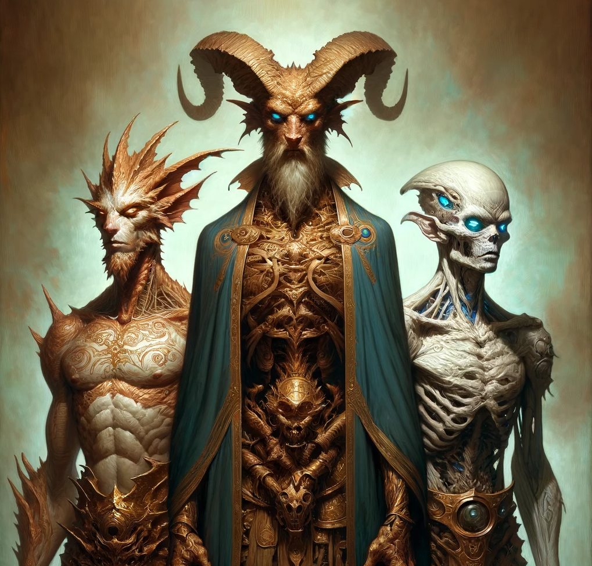
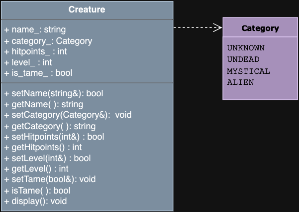

# Algorithmic Adventures II: The Exponential Creature Odyssey

## Project 1 - The Creature Class: A Review of OOP

### Intro


This semester, you will embark on an extraordinary journey developing the infrastructure for a captivating Creature-world simulation. Set within the enchanting depths of a mythical world, your simulation will offer participants a unique open-world experience where they get to capture and tame fantastic Creatures.

The main character, Selfa Ensert, is tasked with collecting multiple Creatures for a mysterious and powerful wizard, allegedly for a Creature zoo, and definitely not for a world-dominating army. Participants of your simulation will interact with various Creatures, including three distinct categories: the Undead, the Mystical, and the Alien.

As participants explore the world, they can encounter creatures such as Dragons, Ghouls, or Mindflayers, each with unique skills, abilities, and quirks. Interactions between creatures are not just about battling to defeat others; it's about forming diverse alliances that can adapt to any situation.

This baseline project aims to acquaint you with the platforms we will use in this course and to refresh your knowledge of basic OOP by implementing the Creature class. You are encouraged to refer to your CSCI 135 coursework as a reference.

### Getting Started with GitHub Classroom

This part is absolutely essential! Don't skip it and do it before proceeding to Part 2.

1. If you don’t already have one, go to [GitHub](https://github.com/) and create a GitHub account. Choose a username you will want to keep, as you will likely use your GitHub account professionally in the future.
2. Watch [this video](https://www.youtube.com/watch?v=MJUJ4wbFm_A) to brush up on or learn the basics of git and GitHub.
3. For this project, we will use GitHub Classroom. Watch [this video](https://www.youtube.com/watch?v=AHDCokfgcSo) to guide you through the entire process, from accepting an assignment to submitting your solution.
4. The link to accept the GitHub Classroom assignment can be found on Blackboard.

The above video will also show you how to submit to Gradescope via GitHub. Make sure to refer back to these instructions when it’s time to submit.

### Additional Resources

If you need to brush up on basic OOP:
- [Code Beauty on constructors and class methods](https://www.youtube.com/watch?v=wxDSYHR52Bg)
- [thenewboston on classes and objects](https://www.youtube.com/watch?v=TT6wCc9JL1U)
- [McProgramming on .hpp and .cpp files](https://www.youtube.com/watch?v=hzS4cGhg0v4)

### Documentation Requirements

For all projects, you will receive 15% points for documentation. These are the requirements:

1. **File Comments:** All files must have a comment preamble with, at minimum, your name, date, and a description of the code implemented in that file.
2. **Function Comments:** All functions (declarations and implementations) must be preceded by a comment preamble including:
    - `@pre:` Describes any precondition.
    - `@param:` One for each parameter the function takes.
    - `@return:` Describes the return type.
    - `@post:` Describes any postconditions.

3. **Inline Comments:** All non-trivial functions must have inline comments. Any block of code that is not self-explanatory must be preceded by a comment describing what it does.

### Part 2 - The Creature Class



You will implement the Creature class. Always separate interface from implementation (`Creature.hpp` and `Creature.cpp`). Work through the tasks sequentially (implement and test). Only move on to a task when you are positive that the previous one has been completed correctly. Remember that the names of classes and methods must exactly match those in this specification. This class has only accessor and mutator functions for its public data members.

#### Task 1: The Creature Class



Every Creature has a Name, Category, Hitpoints, Level, and a boolean indicating if the creature is Tame.

##### Enum and Private Member Variables

The Creature class must define the following type inside the class definition:
```cpp
enum Category {UNKNOWN, UNDEAD, MYSTICAL, ALIEN};
```

The Creature class must have the following private member variables:
```cpp
private:
  std::string name_;
  Category category_;
  int hitpoints_;
  int level_;
  bool tame_;
```

##### Public Member Functions

**Constructors**

```cpp
/**
  Default constructor.
  Default-initializes all private members. 
  Default creature name: "NAMELESS". 
  Booleans are default-initialized to False. 
  Default enum value: UNKNOWN 
  Default Hitpoints and Level: 1.
 */
Creature();

/**
  Parameterized constructor.
  @param      : A reference to the name of the creature (a string). Set the creature's name to NAMELESS if the provided string contains non-alphabetic characters.
  @param      : The category of the creature (a Category enum) with default value UNKNOWN
  @param      : The creature's hitpoints (an integer) , with default value 1 if not provided, or if the value provided is 0 or negative
  @param      : The creature's level (an integer), with default value 1 if not provided, or if the value provided is 0 or negative
  @param      : A flag indicating whether the creature is tame, with default value False
  @post       : The private members are set to the values of the corresponding parameters. The name is converted to UPPERCASE if it consists of alphabetical characters only, otherwise it is set to NAMELESS.
 */
Creature(const std::string &name, Category category = UNKNOWN, int hitpoints = 1, int level = 1, bool tame = false);
```

**Accessors (get) and Mutators (set)**

```cpp
/**
  @param : the name of the Creature, a reference to string
  @post  : sets the Creature's name to the value of the parameter in UPPERCASE. 
           Only alphabetical characters are allowed. 
           If the input contains non-alphabetic characters, do nothing.
  @return : true if the name was set, false otherwise
*/
bool setName(const std::string &name);

/**
  @return : the name of the Creature
*/
std::string getName() const;

/**
  @param  : a reference to Category, the category of the Creature (an enum)
  @post   : sets the Creature's category to the value of the parameter
            If the given category was invalid, set category_ to UNKNOWN.
*/
void setCategory(Category category);

/**
  @return : the category of the Creature (in string form)
*/
std::string getCategory() const;

/**
  @param  : a reference to integer that represents the creature's hitpoints
  @pre    : hitpoints >= 0 : Characters cannot have negative hitpoints 
            (do nothing for invalid input)
  @post   : sets the hitpoints private member to the value of the parameter
  @return : true if the hitpoints were set, false otherwise
*/
bool setHitpoints(int hitpoints);

/**
  @return : the value stored in hitpoints_
*/
int getHitpoints() const;

/**
  @param  : a reference to integer level
  @pre    : level >= 0 : Characters cannot have a negative level
  @post   : sets the level private member to the value of the parameter 
            (do nothing for invalid input)
  @return : true if the level was set, false otherwise
*/
bool setLevel(int level);

/**
  @return : the value stored in level_
*/
int getLevel() const;

/**
  @param  : a reference to boolean value
  @post   : sets the tame flag to the value of the parameter
*/
void setTame(bool tame);

/**
  @return true if the creature is tame, false otherwise
*/
bool isTame() const;

/**
  @post     : displays Creature data in the form:
              "[NAME]\n
               Category: [CATEGORY]\n
               Level: [LEVEL]\n
               Hitpoints: [Hitpoints]\n
               Tame: [TRUE/FALSE]"   
*/
void display() const;
```

### Task 2: Testing

Submit a file called `test.cpp` that includes only a `main` function that does the following:

#### Test Cases

1. **Default Constructor Test:**
    - Instantiate a creature with the default constructor.
    - Set its hitpoints to 10 using the appropriate setter function.
    - Set its level to 5 using the appropriate setter functions.
    - Set its tame flag to True using the appropriate setter function.
    - Print out the creature's information using the `display()` function.

    **Expected output:**
    ```
    NAMELESS
    Category: UNKNOWN
    Level: 5
    Hitpoints: 10
    Tame: TRUE
    ```

2. **Parameterized Constructor Test:**
    - Instantiate a creature with the parameterized constructor with the following creature details:
        - Name: Wormy
        - Category: MYSTICAL
        - Level: 2
        - Hitpoints: 3
    - Set Wormy as Tame with the appropriate setter function.
    - Print out the creature's information using the `display()` function.

    **Expected output:**
    ```
    WORMY
    Category: MYSTICAL
    Level: 2
    Hitpoints: 3
    Tame: TRUE
    ```

### Submission

You will submit your solution to Gradescope via GitHub Classroom

 (see video linked above). The autograder will grade the following files only:
- `Creature.hpp`
- `Creature.cpp`
- `test.cpp`

Although Gradescope allows multiple submissions, it is not a platform for testing and debugging. You MUST test and debug your program locally. To help you not rely too much on Gradescope for testing, we will only allow 5 submissions per day. Before submitting to Gradescope, ensure that your program compiles using the provided Makefile and runs correctly on the Linux machines in the labs at Hunter. This is your baseline; if it runs correctly there, it will run correctly on Gradescope.

### Compiling with Makefile

To compile with your Makefile, use the following command in the terminal, in the same directory as your Makefile and your source files:

```bash
make rebuild
```

This assumes you did not rename the Makefile and that it is the only one in the current directory.

### Incremental Implementation and Testing

You must always implement and test your programs incrementally! Implement and test one method at a time.

For each class and each function within that class:
- Implement one function/method and test it thoroughly (write a main file with multiple test cases + edge cases if applicable).
- Only when you are certain that function works correctly and matches the specification, move on to the next.
- Implement the next function/method and test in the same fashion.

Write your own `main()` function to test your classes. We will provide one with this first project, but you can always add to it. Choose the order in which you implement your methods so that you can test incrementally: i.e. implement constructors then accessor functions, then mutator functions. Sometimes functions depend on one another. If you need to use a function you have not yet implemented, use stubs: a dummy implementation that always returns a single value for testing. Don’t forget to go back and implement the stub!!! If you put the word STUB in a comment, some editors will make it more visible.

### Grading Rubric

- **Correctness:** 80% (distributed across unit testing of your submission)
- **Documentation:** 15%
- **Style and Design:** 5% (proper naming, modularity, and organization)

### Due Date

This project is due on 2/8. No late submissions will be accepted.

### Important Notes

You must start working on the projects as soon as they are assigned to detect any problems and address them with us well before the deadline so that we have time to get back to you before the deadline. There will be no extensions and no negotiation about project grades after the submission deadline.

### Help

Help is available via drop-in tutoring in Lab 1001B (see Blackboard for schedule). Start early to ensure you get the help you need. The days leading up to the due date will be crowded, and you will not be able to get much help then.

### Authors

- Georgina Woo
- Tiziana Ligorio
```
