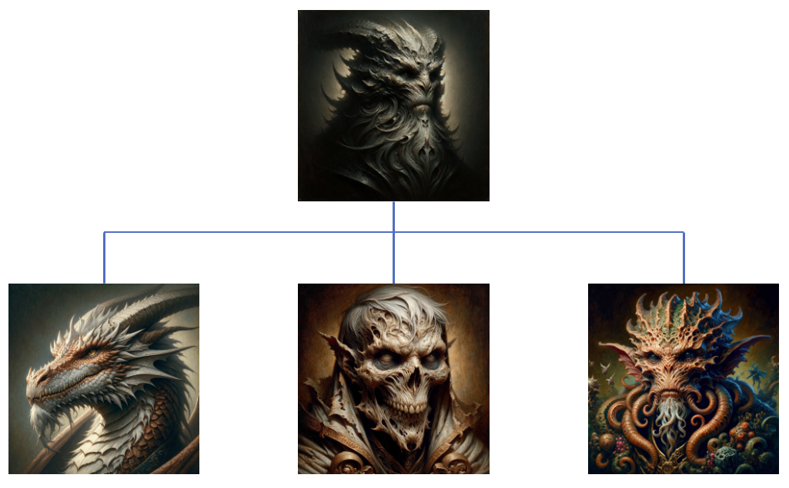
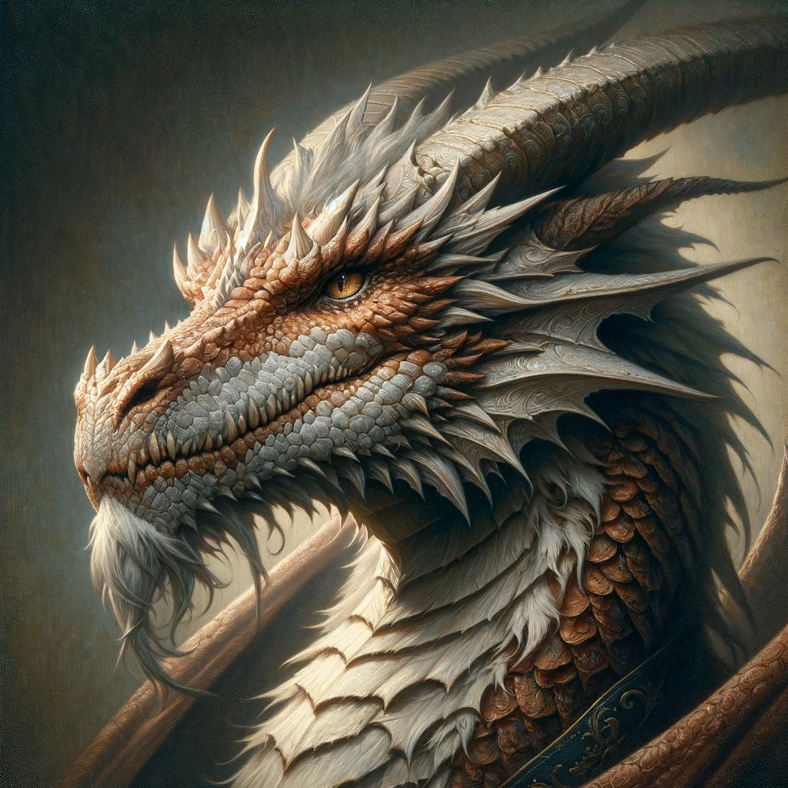
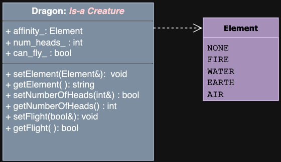
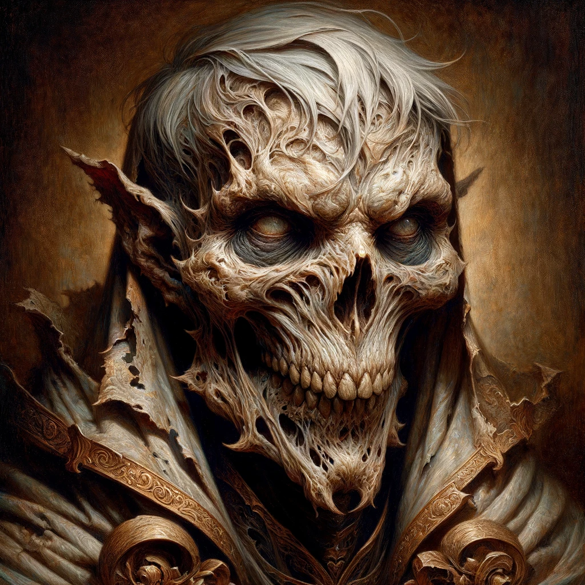
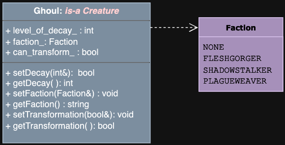
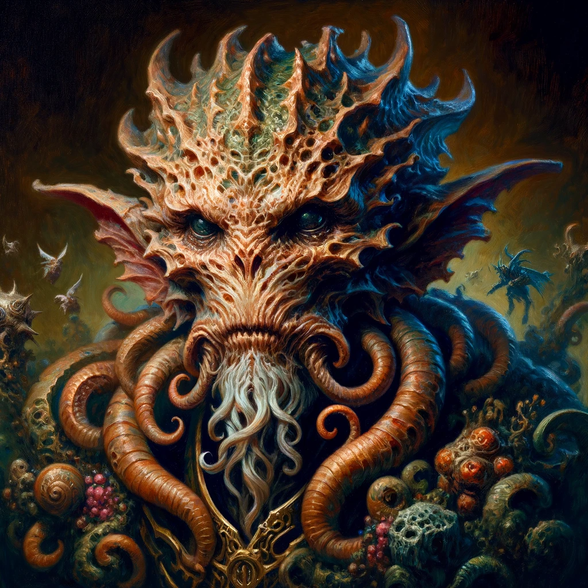
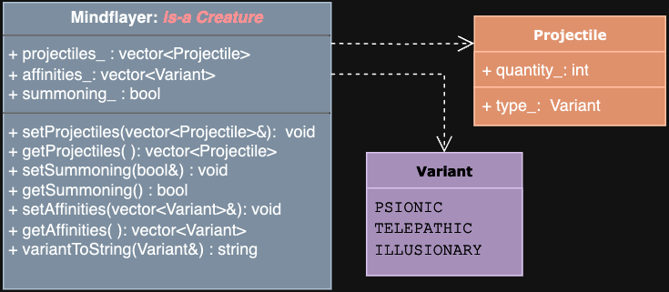

# Algorithmic Adventures II: The Exponential Creature Odyssey

## Project 2 - Creature Types: Inheritance



### Introduction
In this project, you will define different types of Creatures through inheritance. You will implement three new classes that derive from the `Creature` class but also have additional attributes and methods specific to their type.

### Creature Types
1. **Dragon**
2. **Ghoul**
3. **Mindflayer**

### Implementation
Work through the tasks sequentially (implement and test). Only move on to a task when you are positive that the previous one has been completed correctly. Remember that the names of classes and methods must exactly match those in this specification (FUNCTION NAMES, PARAMETER TYPES, RETURNS, PRE, AND POST CONDITIONS MUST MATCH EXACTLY). 

Remember, you must thoroughly document your code!!!

### Task 1: Subclasses

#### The Dragon Class




##### Data Types
The Dragon class must define the following type defined publicly inside the class:
```cpp
enum Element {NONE, FIRE, WATER, EARTH, AIR};
```
##### Private Member Variables
- An Element representing their affinity
- An integer representing the number of heads
- A boolean indicating if they can fly

##### Constructors

```cpp
/**
  Default constructor.
  Default-initializes all private members. 
  Default Category: MYSTICAL
  Default element: NONE
  Default number of head(s): 1
  Booleans are default-initialized to False. 
*/
Dragon();

/**
  Parameterized constructor.
  @param      : The name of the Dragon (a reference to string)
  @param      : The category of the Dragon (a Category enum) with default value MYSTICAL
  @param      : The Dragon's hitpoints (an integer), with default value 1 if not provided, or if the value provided is 0 or negative
  @param      : The Dragon's level (an integer), with default value 1 if not provided, or if the value provided is 0 or negative
  @param      : A flag indicating whether the Dragon is tame, with default value False
  @param      : The element (an Element enum), with default value NONE if not provided
  @param      : The number of heads (an integer), with default value 1 if not provided, or if the value provided is 0 or negative
  @param      : A flag indicating whether the Dragon can fly, with default value False
  @post       : The private members are set to the values of the corresponding parameters.
  Hint: Notice the default arguments in the parameterized constructor.
*/
Dragon(const std::string &name, Category category = MYSTICAL, int hitpoints = 1, int level = 1, bool tame = false, Element element = NONE, int numberOfHeads = 1, bool flight = false);
```

##### Unique Methods

```cpp
/**
  Getter for the element.
  @return     : The element (a string representation of the Element enum)
*/
std::string getElement() const;

/**
  Setter for the element.
  @param      : A reference to the element (an Element enum)
  @post       : The element is set to the value of the parameter.
*/
void setElement(Element element);

/**
  Getter for the number of heads.
  @return     : The number of heads (an integer)
*/
int getNumberOfHeads() const;

/**
  Setter for the number of heads.
  @param      : A reference to the number of heads (an integer)
  @pre        : The number of heads is > 0. Do nothing for invalid values.
  @post       : The number of heads is set to the value of the parameter.
  @return     : True if the number of heads is set, false otherwise.
*/
bool setNumberOfHeads(int numberOfHeads);

/**
  Getter for the flight flag.
  @return     : The flight flag (a boolean)
*/
bool getFlight() const;

/**
  Setter for the flight flag.
  @param      : A reference to the flight flag (a boolean)
  @post       : The flight flag is set to the value of the parameter.
*/
void setFlight(bool flight);
```

#### The Ghoul Class




##### Data Types
The Ghoul class must define the following type defined publicly inside the class:
```cpp
enum Faction {NONE, FLESHGORGER, SHADOWSTALKER, PLAGUEWEAVER};
```

##### Private Member Variables
- An integer representing their level of decay
- A Faction representing their faction
- A boolean indicating if they can transform

##### Constructors

```cpp
/**
  Default constructor.
  Default-initializes all private members. 
  Default Category: UNDEAD
  Default decay: 0
  Default faction: NONE
  Booleans are default-initialized to False. 
*/
Ghoul();

/**
  Parameterized constructor.
  @param      : The name of the Ghoul (a reference to string)
  @param      : The category of the Ghoul (a Category enum) with default value UNDEAD
  @param      : The Ghoul's hitpoints (an integer), with default value 1 if not provided, or if the value provided is 0 or negative
  @param      : The Ghoul's level (an integer), with default value 1 if not provided, or if the value provided is 0 or negative
  @param      : A flag indicating whether the Ghoul is tame, with default value False
  @param      : The level of decay (an integer), with default value 0 if not provided, or if the value provided is negative
  @param      : The faction (a Faction enum), with default value NONE if not provided
  @param      : A flag indicating whether the Ghoul can transform, with default value False
  @post       : The private members are set to the values of the corresponding parameters.
  Hint: Notice the default arguments in the parameterized constructor.
*/
Ghoul(const std::string &name, Category category = UNDEAD, int hitpoints = 1, int level = 1, bool tame = false, int decay = 0, Faction faction = NONE, bool transformation = false);
```

##### Unique Methods

```cpp
/**
  Getter for the level of decay.
  @return     : The level of decay (an integer)
*/
int getDecay() const;

/**
  Setter for the level of decay.
  @param      : A reference to the level of decay (an integer)
  @pre        : The level of decay must be >= 0 (do nothing otherwise)
  @post       : The level of decay is set to the value of the parameter.
  @return     : true if the level of decay was set, false otherwise
*/
bool setDecay(int decay);

/**
  Getter for the faction.
  @return     : The faction (a string representation of the Faction enum)
*/
std::string getFaction() const;

/**
  Setter for the faction.
  @param      : A reference to the faction (a Faction enum)
  @post       : The faction is set to the value of the parameter.
*/
void setFaction(Faction faction);

/**
  Getter for the transformation.
  @return     : The transformation (a boolean)
*/
bool getTransformation() const;

/**
  Setter for the transformation.
  @param      : A reference to the transformation (a boolean)
  @post       : The transformation is set to the value of the parameter.
*/
void setTransformation(bool transformation);
```

#### The Mindflayer Class




##### Data Types
The Mindflayer class must define the following types defined publicly inside the class:
```cpp
enum Variant {PSIONIC, TELEPATHIC, ILLUSIONARY};

struct Projectile {
    Variant type_;
    int quantity_;
};
```

##### Private Member Variables
- A vector of Projectiles
- A vector of Variants representing their affinities
- A boolean indicating if they are able to summon a Thoughtspawn

##### Constructors

```cpp
/**
  Default constructor.
  Default-initializes all private members. 
  Default Category: ALIEN
  Default summoning: False
*/
Mindflayer();

/**
  Parameterized constructor.
  @param      : A reference to the name of the Mindflayer (a string)
  @param      : The category of the Mindflayer (a Category enum) with default value ALIEN
  @param      : The Mindflayer's hitpoints (an integer), with default value 1 if not provided, or if the value provided is 0 or negative
  @param      : The Mindflayer's level (an integer), with default value 1 if not provided, or if the value provided is 0 or negative
  @param      : A flag indicating whether the Mindflayer is tame, with default value False
  @param      : The projectiles (a vector of Projectile structs), with default value an empty vector if not provided
  @param      : A flag indicating whether the Mindflayer can summon, with default value False
  @param      : The affinities (a vector of Variant enums), with default value an empty vector if not provided
  @post       : The private members are set to the values of the corresponding parameters.
  Hint: Notice the default arguments in the parameterized constructor.
*/
Mindflayer(const std::string &name, Category category = ALIEN, int hitpoints = 1, int level = 1, bool tame = false, std::vector<Projectile> projectiles = {}, bool summoning = false, std::vector<Variant> affinities = {});
```
##### Unique Methods

```cpp
/**
  Getter for the projectiles.
  @return     : The projectiles (a vector of Projectile structs)
*/
getProjectiles

/**
  Setter for the projectiles.
  @param      : A reference to the projectiles (a vector of Projectile structs)
  @post       : The projectiles are set to the value of the parameter. There should not be any duplicate projectiles in Mindflayer's projectiles vector.
        : For example, if the vector in the given parameter contains the following Projectiles: {{PSIONIC, 2}, {TELEPATHIC, 1}, {PSIONIC, 1}, {ILLUSIONARY, 3}}, 
        : the projectiles vector should be set to contain the following Projectiles: {{PSIONIC, 3}, {TELEPATHIC, 1}, {ILLUSIONARY, 3}}.
        : If the quantity of a projectile is 0 or negative, it should not be added to the projectiles vector. 
        : Note the order of the projectiles in the vector.
*/
setProjectiles

/**
  Getter for the summoning.
  @return     : The summoning (a boolean)
*/
getSummoning

/**
  Setter for the summoning.
  @param      : A reference to the summoning (a boolean)
  @post       : The summoning is set to the value of the parameter.
*/
setSummoning

/**
  Getter for the affinities.
  @return     : The affinities (a vector of Variant enums)
*/
getAffinities

/**
  Setter for the affinities.
  @param      : A reference to the affinities (a vector of Variant enums)
  @post       : The affinities are set to the value of the parameter.
        : There should not be any duplicate affinities in Mindflayer's affinities vector. 
        : For example, if the vector in the given parameter contains the following affinities: {PSIONIC, TELEPATHIC, PSIONIC, ILLUSIONARY}, 
        : the affinities vector should be set to contain the following affinities: {PSIONIC, TELEPATHIC, ILLUSIONARY}.
        : Note the order of the affinities in the vector.
*/
setAffinities

/**
  @param       : A reference to the Variant 
  @return      : The string representation of the variant
*/
variantToString
```

---

## Task 2: Testing

To give you a feel and guide into testing, we have added a testing task to this project. The task below is not a thorough test of your classes. You must test every function you implement with valid and invalid values and ensure it behaves as specified. This task is intended to motivate you to build a methodical and incremental testing practice.

### Testing Program (`test.cpp`)

Instantiate the following creature objects that derive from the Creature class. For each creature object, print out the creature's information, including private member variables that are unique to their subclass, using the appropriate getter functions in the specified format:

#### Format for Dragons:
```
NAME: [NAME]
CATEGORY: [CATEGORY]
HP: [HITPOINTS]
LVL: [LEVEL]
TAME: [TAME]
ELEMENT: [ELEMENT]
HEADS: [NUMBER OF HEADS]
FLIGHT: [FLIGHT]
```

#### Format for Ghouls:
```
NAME: [NAME]
CATEGORY: [CATEGORY]
HP: [HITPOINTS]
LVL: [LEVEL]
TAME: [TAME]
DECAY: [DECAY]
FACTION: [FACTION]
TRANSFORM: [TRANSFORM]
```

#### Format for Mindflayers:
```
NAME: [NAME]
CATEGORY: [CATEGORY]
HP: [HITPOINTS]
LVL: [LEVEL]
TAME: [TAME]
SUMMONING: [SUMMONING]
[PROJECTILE TYPE 1]: [QUANTITY 1]
[PROJECTILE TYPE 2]: [QUANTITY 2]
AFFINITIES:
[AFFINITY 1]
[AFFINITY 2]
```

### ***test.cpp***:

#### Dragons:

**2.1.1 Instantiate a default Dragon**
- Print out the information for the default Dragon based on the format above.

**2.1.2 Instantiate a Dragon with the parameterized constructor with the following creature details:**
- Name: Smog
- Print out the information for Smog based on the format above.

**2.1.3 Instantiate a Dragon with the parameterized constructor with the following creature details:**
- Name: BURNY
- Category: UNDEAD
- Hitpoints: 100
- Level: 10
- Tame: True
- Element: FIRE
- Number of heads: 1
- Flight: True
- Print out the information for Burny based on the format above.

**2.1.4 Make the following changes to Burny using the appropriate setter functions:**
- Set the element to WATER
- Set the number of heads to 2
- Set the number of heads to 0
- Set the flight flag to False
- Print out the information for Burny based on the format above.

#### Ghouls:

**2.2.1 Instantiate a default Ghoul**
- Print out the information for the default Ghoul based on the format above.

**2.2.2 Instantiate a Ghoul with the parameterized constructor with the following creature details:**
- Name: Homph
- Print out the information for Homph based on the format above.

**2.2.3 Instantiate a Ghoul with the parameterized constructor with the following creature details:**
- Name: CHOMPER
- Category: ALIEN
- Hitpoints: 100
- Level: 10
- Tame: True
- Decay: 3
- Faction: FLESHGORGER
- Transform: True
- Print out the information for Chomper based on the format above.

**2.2.4 Make the following changes to Chomper using the appropriate setter functions:**
- Set the decay to 2
- Set the decay to -20
- Set the faction to SHADOWSTALKER
- Set the transformation flag to False
- Print out the information for Chomper based on the format above.

#### Mindflayers:

**2.3.1 Instantiate a default Mindflayer**
- Print out the information for the default Mindflayer based on the format above.

**2.3.2 Instantiate a Mindflayer with the parameterized constructor with the following creature details:**
- Name: BIGBRAIN
- Category: MYSTICAL
- Hitpoints: 100
- Level: 10
- Tame: True
- Projectiles: {{PSIONIC, 2}, {TELEPATHIC, 1}, {PSIONIC, 1}, {ILLUSIONARY, 3}}
- Summoning: True
- Affinities: {PSIONIC, TELEPATHIC, PSIONIC, ILLUSIONARY}
- Print out the information for Bigbrain based on the format above.

---


### Compilation
Use the provided Makefile to compile your program:
```sh
make rebuild
```

### Incremental Development
Implement and test your program incrementally:
1. Implement one function/method.
2. Write multiple test cases, including edge cases.
3. Ensure the function behaves as expected before moving to the next.

### Submission
Submit the following files:
- Dragon.hpp
- Dragon.cpp
- Mindflayer.hpp 
- Mindflayer.cpp
- Ghoul.hpp
- Ghoul.cpp
- test.cpp

Ensure your program compiles and runs correctly on the provided Linux machines.

### Grading Rubric
- Correctness: 80%
- Documentation: 15%
- Style and Design: 5%

### Due Date
This project is due on 2/19. No late submissions will be accepted.

### Help
Help is available via drop-in tutoring in Lab 1001B. Start early to ensure you can get assistance if needed.

### Authors
Georgina Woo, Tiziana Ligorio
