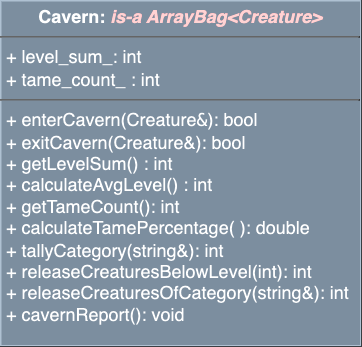

# Algorithmic Adventures II: Exponential Creature Odyssey

## Project 3 - The Cavern


### Overview

In this project, you will create a simulation setting by implementing the `Cavern` class, which will house your Creatures. You will add functionality to add and remove Creatures from the Cavern, query the Cavern for information about the Creatures it contains, and release Creatures based on their level and category.

### Assignment

To accept the GitHub Classroom assignment, please find the link on Blackboard.

### Project Structure

This project consists of two main parts:

1. **Modify the Creature class**
2. **Implement the Cavern class**, as a subclass of `ArrayBag` that holds `Creature` objects

**Note:** You will **NOT** modify the `ArrayBag` class. It remains as distributed.

### Additional Resources

#### Abstract Data Types
- [Geeks for Geeks](https://www.geeksforgeeks.org/data-structures/)
- [Neso Academy](https://www.nesoacademy.org)

#### Template Classes
- [CPP Manual](https://www.cppreference.com)
- [Geeks for Geeks](https://www.geeksforgeeks.org/templates-cpp/)
- [Tutorials Point](https://www.tutorialspoint.com/cplusplus/cpp_templates.htm)

#### Operator Overloading
- [CPP Manual](https://www.cppreference.com)
- [Geeks for Geeks](https://www.geeksforgeeks.org/operator-overloading-c/)
- [Programiz](https://www.programiz.com/cpp-programming/operator-overloading)

### Implementation

Work through the tasks sequentially (implement and test). Only move on to a task when you are confident that the previous one has been completed correctly. Ensure that the names of classes and methods exactly match those in this specification.

**Important:** You must thoroughly document your code!

### Task 1: Modify the `Creature` Class


Define and implement the following additional public member functions:

```cpp
/**
  @param      : a const reference to the right-hand side of the == operator.
  @return     : Returns true if the right-hand side creature is "equal", false otherwise.
                Two creatures are equal if they have the same name, same category, same level, and if they're either both tame or both not.

  Example: For creature1 to be == to creature2, we need:
  - The same name
  - The same category
  - The same level
  - They must either be both tame or both not
*/
bool operator==(const Creature& rhs) const;

/**
  @param      : a const reference to the right-hand side of the != operator.
  @return     : Returns true if the right-hand side creature is NOT "equal" (!=), false otherwise.
                Two creatures are NOT equal if any of their name, category, or level are not equal, or if one is tame and the other is not.
*/
bool operator!=(const Creature& rhs) const;
```

### Task 2: Implement the `Cavern` Class as a Subclass of `ArrayBag`


The `Cavern` is a subclass of `ArrayBag` that stores `Creature` objects.



#### Data Types

The `Cavern` class must have the following private member variables:
- An integer sum of the levels of all the creatures currently in the Cavern.
- An integer count of all the creatures currently in the Cavern that are tame.

#### Public Member Functions

Constructor:

```cpp
/**
  Default constructor.
  Default-initializes all private members. 
*/
Cavern();
```

Unique Methods:

```cpp
/**
  * @param   :   A reference to a Creature entering the Cavern
  * @post    :   If the given Creature is not already in the Cavern, add Creature to the Cavern and updates the level sum and the tame Creature count if the creature is tame.
  * @return  :   returns true if a Creature was successfully added to the Cavern, false otherwise
**/
bool enterCavern(const Creature& creature);

/**
  * @param   :   A reference to a Creature leaving the Cavern
  * @return  :   returns true if a creature was successfully removed from the Cavern (i.e. items_), false otherwise
  * @post    :   removes the creature from the Cavern and updates the level sum. 
                  If the Creature is tame, it also updates the tame count.
**/
bool exitCavern(const Creature& creature);

/**
  * @return   :  The integer level count of all the creatures currently in the Cavern
**/
int getLevelSum() const;

/**
  * @return   :  The average level (int) of all the creatures in the Cavern
  * @post     :  Computes the average level (double) of the Cavern rounded to the NEAREST integer.
**/
int calculateAvgLevel() const;

/**
  * @return   :  The integer count of tame Creatures in the Cavern
**/
int getTameCount() const;

/**
  * @return   :  The percentage (double) of all the tame creatures in the Cavern
  * @post     :   Computes the percentage of tame creatures in the Cavern rounded up to 2 decimal places.
**/
double calculateTamePercentage() const;

/**
  * @param  :   A reference to a string representing a creature Category with value in ["UNKNOWN", "UNDEAD", "MYSTICAL", "ALIEN"]
  * @return  :  An integer tally of the number of creatures in the Cavern of the given category. 
              If the argument string does not match one of the expected category values, the tally is zero. 
              NOTE: no pre-processing of the input string necessary, only uppercase input will match.
**/
int tallyCategory(const std::string& category) const;

/**
  * @param  :   An integer representing the level threshold of the creatures to be removed from the Cavern, with default value 0
  * @post   :   Removes all creatures from the Cavern whose level is less than the given level. If no level is given, removes all creatures from the Cavern. Ignore negative input.
  * @return :   The number of creatures removed from the Cavern
**/
int releaseCreaturesBelowLevel(int level = 0);

/**
  * @param  : A reference to a string representing a creature Category with a value in ["UNKNOWN", "UNDEAD", "MYSTICAL", "ALIEN"], or default value "ALL" if no category is given
  * @post   : Removes all creatures from the Cavern whose category matches the given category. If no category is given, removes all creatures from the Cavern.
  * @return : The number of creatures removed from the Cavern
              NOTE: no pre-processing of the input string necessary, only uppercase input will match. If the input string does not match one of the expected category values, do not remove any creatures.
**/
int releaseCreaturesOfCategory(const std::string& category = "ALL");

/**
  * @post    : Outputs a report of the creatures currently in the Cavern in the form:
              "UNKNOWN: [x]\nUNDEAD: [x]\nMYSTICAL: [x]\nALIEN: [x]\n\nAVERAGE LEVEL: [x]\nTAME:[x]%\n"
              Note that the average level should be rounded to the NEAREST integer, and the percentage of tame creatures in the Cavern should be rounded to 2 decimal places.

              Example output: 
              UNKNOWN: 1
              UNDEAD: 3
              MYSTICAL: 2
              ALIEN: 1

              AVERAGE LEVEL: 5
              TAME: 85.72%
**/
void cavernReport() const;
```


### Testing

Although you will no longer submit your test file, you must continue to thoroughly and methodically test your code.

1. **Stub All Expected Functions:** Ensure all function declarations are in the `.hpp` file and stubs for all functions are in the `.cpp` file.
2. **Implement and Test Incrementally:** Implement constructors, accessor functions, and mutator functions one by one, testing each thoroughly.
3. **Main Testing Function:** Write a `main()` function to test your implementation.
4. **Include All Necessary Libraries:** Make sure to include all packages and libraries you use.

### Compiling with Makefile

To compile with your Makefile, use the following command in the terminal, in the same directory as your Makefile and your source files:

```bash
make rebuild
```

This assumes you did not rename the Makefile and that it is the only one in the current directory.

### Grading Rubric

- **Correctness:** 80% (distributed across unit testing of your submission)
- **Documentation:** 15%
- **Style and Design:** 5% (proper naming, modularity, and organization)

**Note:** Start working on the projects as soon as they are assigned to detect any problems and address them with us well before the deadline.

### Submission

You will submit the following files:
- `Creature.hpp`
- `Creature.cpp`
- `Cavern.hpp`
- `Cavern.cpp`

### Important Notes

- You must start working on the projects as soon as they are assigned to detect any problems.
- There will be no extensions and no negotiation about project grades after the submission deadline.

### Help

Help is available via drop-in tutoring in Lab 1001B (see the website for the schedule). Start early to ensure you get the help you need.

### Authors

- Georgina Woo
- Tiziana Ligorio
```
