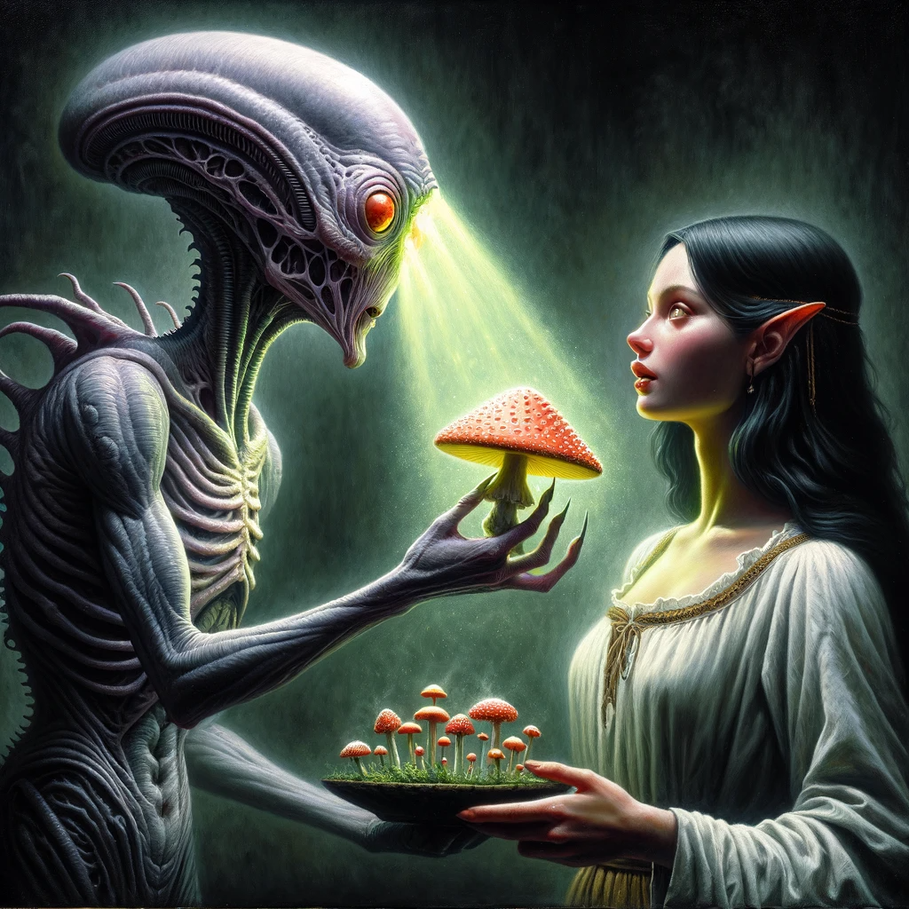
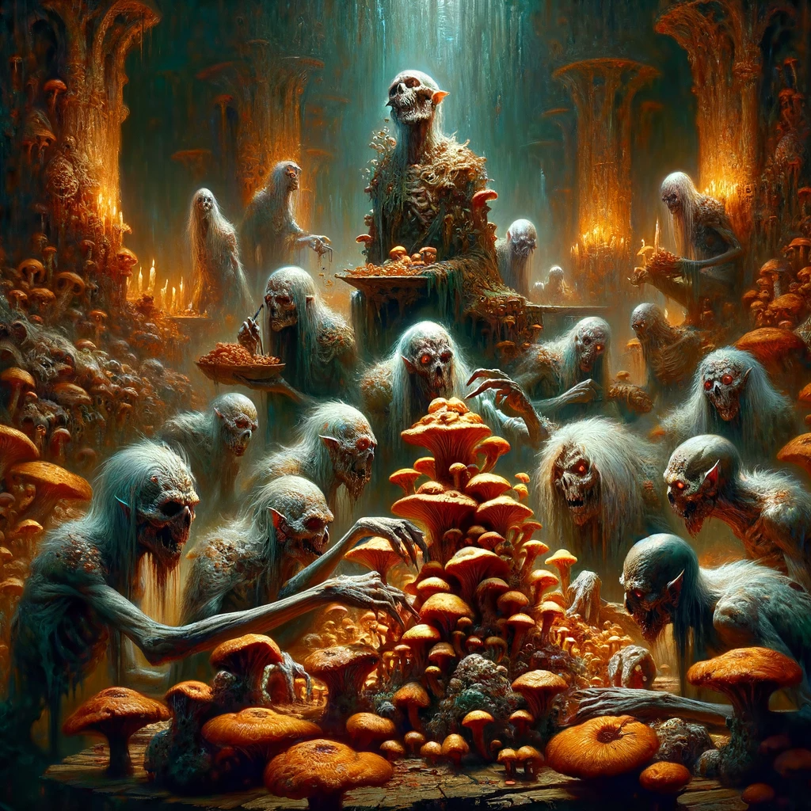

# Algorithmic Adventures II: Exponential Creature Odyssey

## Project 4 - The MycoMorsel


### Overview

Now that we have our full-fledged Creatures and a game world, let's implement some game functionality. In this project, you will modify the classes you have implemented thus far to allow Creatures to be fed – after all, a hungry Creature is an angry Creature, and one does not want to be in a Cavern with angry Creatures. Conveniently, the Cavern seems to be home to a variety of fungi, from which Selfa Ensert has managed to create MycoMorsel, a food derived from fungus. This might be a cost-effective, albeit dubious, form of sustenance for the Creatures, but eating MycoMorsels will most likely affect each Creature subclass and type differently. Have your Dragons, Ghouls, and Mindflayers feast in the Cavern by eating MycoMorsel and see what happens to them!

### Getting Started

To accept the GitHub Classroom assignment, please find the link on Blackboard.

### Project Structure

This project consists of two main parts:
1. Modify the `Creature` class and its subclasses to enable them to eat MycoMorsel and display their current status.
2. Modify the `Cavern` class to store Creature subclasses polymorphically and access each subclass-specific MycoMorsel actions.

### Additional Resources

- **Abstract Classes and Polymorphism:**
  - [Pure Virtual and Abstract Classes](https://www.geeksforgeeks.org/abstract-classes-in-cpp/)
  - [Early vs Late binding](https://www.geeksforgeeks.org/early-binding-and-late-binding-in-cpp/)
- **Reading from input file:**
  - [ifstream](https://www.geeksforgeeks.org/basic-ifstream-c/)
  - [stringstream](https://www.geeksforgeeks.org/stringstream-c-applications/)
  - [getline](https://www.geeksforgeeks.org/getline-string-c/)
- **String manipulation:**
  - [C++ Substring of a given string](https://www.geeksforgeeks.org/substr-in-cpp/)
  - [C++ find position of a string inside another string](https://www.geeksforgeeks.org/find-in-cpp/)
- **Dynamic memory allocation:**
  - [new and delete key words](https://www.geeksforgeeks.org/new-and-delete-operators-in-cpp-for-dynamic-memory/)

### Implementation

Work through the tasks sequentially (implement and test). Only move on to a task when you are positive that the previous one has been completed correctly. Ensure that the names of classes and methods exactly match those in this specification.

**Important:** You must thoroughly document your code!

### MycoMorsel Feast


#### Task 1: Modify the Creature Class and Its Subclasses

**Modify the Creature class as follows:**

- Make the `display()` function pure virtual.
- Add the following public member function and make it pure virtual:

```cpp
/**
  @post     : Modifies the creature's private member variables (the exact modifications will be subclass-specific)
  @return   : true if the creature leaves the Cavern, false otherwise
*/
virtual bool eatMycoMorsel() = 0;
```

**Modify the Dragon class as follows:**


- Add the following public member functions:

```cpp
/**
  @post     : displays Dragon data in the form:
  "DRAGON - [NAME]\n
  CATEGORY: [CATEGORY]\n
  HP: [HITPOINTS]\n
  LVL: [LEVEL]\n
  TAME: [TRUE/FALSE]\n
  ELEMENT: [ELEMENT]\n
  HEADS: [NUMBER OF HEADS]\n
  IT [CAN/CANNOT] FLY\n"
  
  Example:
  DRAGON - JHIZARD
  CATEGORY: ALIEN
  HP: 7
  LVL: 5
  TAME: TRUE
  ELEMENT: FIRE
  HEADS: 3
  IT CAN FLY
*/
void display() const override;

/**
  @post   : Modifies the creature based on its category and element when it eats a MycoMorsel.
  @return : true if the creature leaves the Cavern, false otherwise
*/
bool eatMycoMorsel() override;
```

**Modify the Ghoul class as follows:**


- Add the following public member functions:

```cpp
/**
  @post     : displays Ghoul data in the form:
  GHOUL - [NAME]\n
  CATEGORY: [CATEGORY]\n
  HP: [HITPOINTS]\n
  LVL: [LEVEL]\n
  TAME: [TRUE/FALSE]\n
  DECAY: [DECAY]\n
  FACTION: [FACTION]\n
  IT [CAN/CANNOT] TRANSFORM\n"
  
  Example:
  GHOUL - JHRAT
  CATEGORY: MYSTICAL
  HP: 4
  LVL: 8
  TAME: TRUE
  DECAY: 3
  FACTION: FLESHGORGER
  IT CAN TRANSFORM
*/
void display() const override;

/**
  @post   : Modifies the creature based on its faction when it eats a MycoMorsel.
  @return : true if the creature leaves the Cavern, false otherwise
*/
bool eatMycoMorsel() override;
```

**Modify the Mindflayer class as follows:**



- Add the following public member functions:

```cpp
/**
  @post     : displays Mindflayer data in the form:
  "MINDFLAYER - [NAME]\n
  CATEGORY: [CATEGORY]\n
  HP: [HITPOINTS]\n
  LVL: [LEVEL]\n
  TAME: [TRUE/FALSE]\n
  SUMMONING: [SUMMONING]\n
  [PROJECTILE TYPE 1]: [QUANTITY 1]\n
  [PROJECTILE TYPE 2]: [QUANTITY 2]\n
  AFFINITIES: \n
  [AFFINITY 1]\n
  [AFFINITY 2]\n"

  Example:
  MINDFLAYER - JHOCTOPUS
  CATEGORY: UNDEAD
  HP: 3
  LVL: 6
  TAME: TRUE
  SUMMONING: TRUE
  PSIONIC: 2
  TELEPATHIC: 11
  AFFINITIES: 
  PSIONIC
  ILLUSIONARY
*/
void display() const override;

/**
  @post   : Modifies the creature based on its affinities and projectiles when it eats a MycoMorsel.
  @return : true if the creature leaves the Cavern, false otherwise
*/
bool eatMycoMorsel() override;
```

#### Task 2: Modify the Cavern Class

 
 


- Modify the Cavern to now store pointers to Creatures, rather than Creature objects.
- Implement a parameterized constructor:

```cpp
/**
  @param: the name of an input file (a string reference)
  @pre: Formatting of the csv file is as follows (each numbered item appears separated by comma, only one value for each numbered item):
  1. TYPE: An uppercase string [DRAGON, GHOUL, MINDFLAYER]
  2. NAME: An uppercase string
  3. CATEGORY: An uppercase string [ALIEN, MYSTICAL, UNDEAD]
  4. HITPOINTS: A positive integer
  5. LEVEL: A positive integer
  6. TAME: 0 (False) or 1 (True)
  7. ELEMENT/FACTION: Uppercase string or strings representing the ELEMENT (For Dragons), or FACTION (For Ghouls) of the creature. If the creature is of a different subclass, the value will be NONE
  8. HEADS: A positive integer of the number of heads the Dragon has. If the creature is of a different subclass, the value will be 0
  9. FLIGHT/TRANSFORM/SUMMONING: 0 (False) or 1 (True) representing if the creature can fly (Dragons), transform (Ghouls), or summon a Thoughtspawn (Mindflayers).
  10. DECAY: A non-negative integer representing the level of decay of the Ghoul. If the creature is of a different subclass, the value will be 0
  11. AFFINITIES: Only applicable to Mindflayers. Affinities are of the form [AFFINITY1];[AFFINITY2] where multiple affinities are separated by a semicolon. The value may be NONE for a Mindflayer with no affinities, or creatures of other subclasses.
  12. PROJECTILES: Only applicable to Mindflayers. PROJECTILES are of the form [PROJECTILE TYPE1]-[QUANTITY];[PROJECTILE TYPE 2]-[QUANTITY] where multiple types of projectiles are separated by a semicolon. The value may be NONE for a Mindflayer with no projectiles, or creatures of other subclasses.
*/
Cavern(const std::string& inputFile);
```

- Add the following public member functions:

```cpp
/**
  @post: For every creature in the cavern, displays each creature's information
*/
void displayCreatures() const;

/**
  @param: a string reference to a category
  @post: For every creature in the cavern of the given category (only exact matches to the input string), displays each creature's information
*/
void displayCategory(const std

::string& category) const;

/**
  @post: Every creature in the cavern eats a MycoMorsel.
*/
void mycoMorselFeast();
```

### Testing

Although you will no longer submit your test file, you must continue to thoroughly and methodically test your code.

Start by stubbing all expected functions. Have all function declarations in the `.hpp` and stubs for all functions in the `.cpp`. When submitted as such, your program will compile, although you will fail all tests since you have not implemented any functions yet. If your program compiles, you will have at least established that all functions have the correct name, parameters, and return type.

What is a stub? A stub is a dummy implementation that always returns a single value for testing (or has an empty body if void). Don’t forget to go back and implement the stub! If you put the word STUB in a comment, some editors will make it more visible.

Now you can start implementing and testing your project, ONE FUNCTION AT A TIME!

Write a `main()` function to test your implementation. Choose the order in which you implement your methods so that you can test incrementally: i.e., implement constructors, then accessor functions, then mutator functions.

For each class, test each function you implement with all edge cases before you move on to implement the next function. This includes all constructors.

Make sure you include all packages and libraries you use.

### Compiling with Makefile

To compile with your Makefile, use the following command in the terminal, in the same directory as your Makefile and your source files:

```bash
make rebuild
```

This assumes you did not rename the Makefile and that it is the only one in the current directory.

### Grading Rubric

- **Correctness:** 80% (distributed across unit testing of your submission)
- **Documentation:** 15%
- **Style and Design:** 5% (proper naming, modularity, and organization)

**Important:** Start working on the projects as soon as they are assigned to detect any problems with submitting your code and to address them with us well before the deadline.

### Submission

You will submit the following files:
- `Creature.hpp`
- `Creature.cpp`
- `Dragon.hpp`
- `Dragon.cpp`
- `Ghoul.hpp`
- `Ghoul.cpp`
- `Mindflayer.hpp`
- `Mindflayer.cpp`
- `Cavern.hpp`
- `Cavern.cpp`

Although Gradescope allows multiple submissions, it is not a platform for testing and debugging. You MUST test and debug your program locally. To help you not rely too much on Gradescope for testing, we will only allow 5 submissions per day. Before submitting to Gradescope, ensure that your program compiles using the provided Makefile and runs correctly on the Linux machines in the labs at Hunter. This is your baseline; if it runs correctly there, it will run correctly on Gradescope. If not, you will have the necessary feedback (compiler error messages, debugger, or program output) to guide you in debugging, which you don’t have through Gradescope.

**Due date:** This project is due on Thursday 3/21. No late submissions will be accepted.

### Important Notes

You must start working on the projects as soon as they are assigned to detect any problems and address them with us well before the deadline so that we have time to get back to you before the deadline. There will be no extensions and no negotiation about project grades after the submission deadline.

### Help

Help is available via drop-in tutoring in Lab 1001B (see the website for the schedule). Start early to ensure you get the help you need. The days leading up to the due date will be crowded, and you will not be able to get much help then.

### Authors

- Georgina Woo
- Tiziana Ligorio
```
