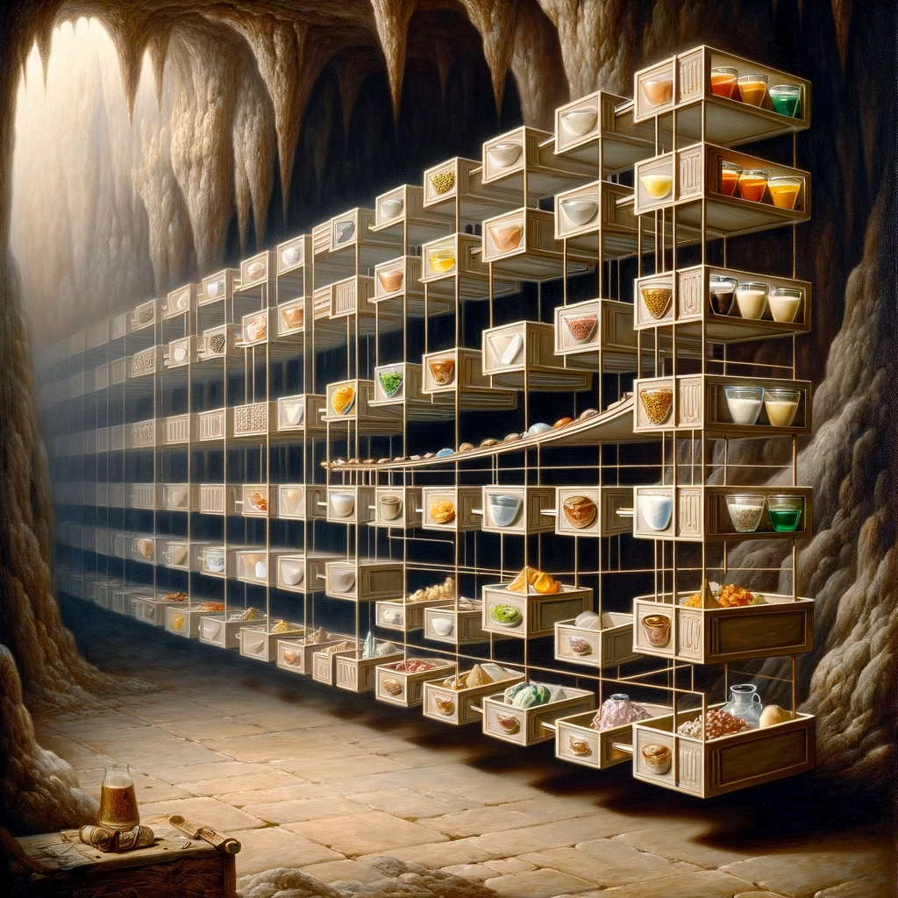
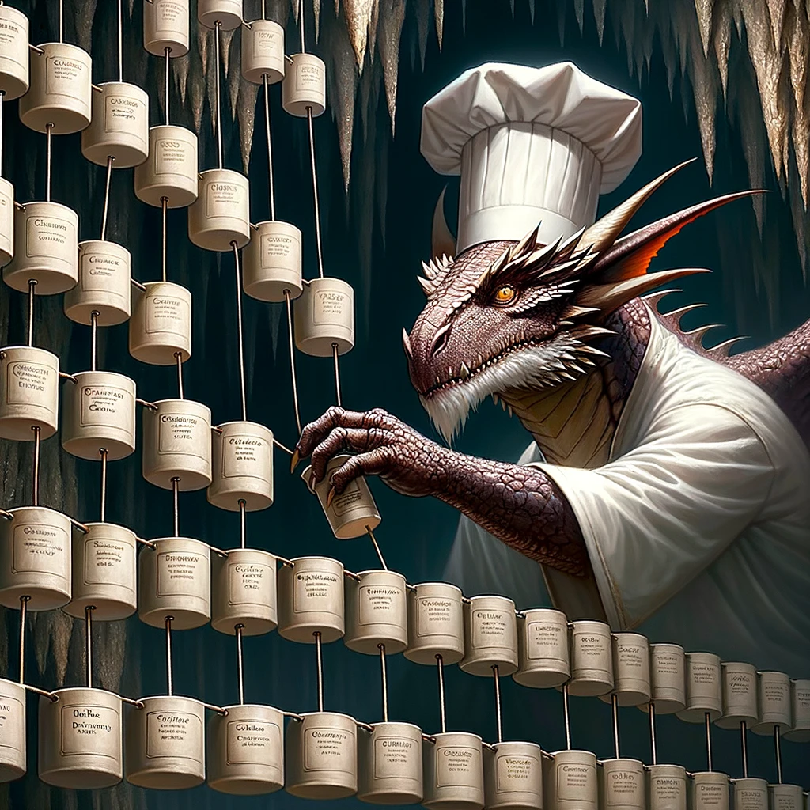
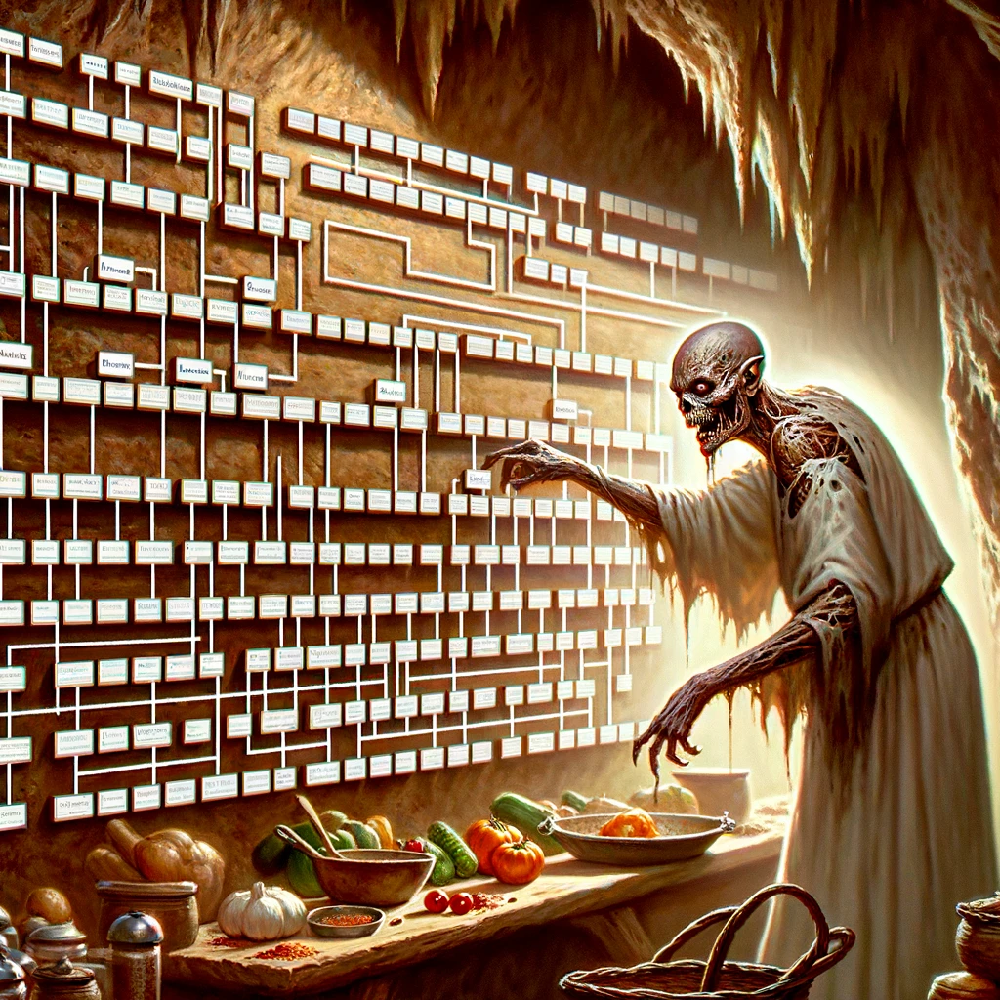

# Algorithmic Adventures II: Exponential Creature Odyssey

## Project 5 - Ingredient Management with Linked Lists


### Overview

Most of our Creatures weren't too happy with the MycoMorsels. It may be time to start making something more edible to feed the Creatures of the Cavern. In this project, you will build the `Ingredient` struct and the `Pantry` class to manage recipes and craft new Ingredients. This will allow even our Creatures to whip up the most delicious recipes!

### Getting Started

To accept the GitHub Classroom assignment, please find the link on Blackboard.

### Project Structure

This project consists of three tasks:

1. Implement the `Ingredient` struct within the interface of the `Pantry` class (`Pantry.hpp`) but outside of the `Pantry` class definition.
2. Implement the `Pantry` class to store POINTERS to `Ingredient` objects as a subclass of `LinkedList`.
3. Test the `Pantry` class with the provided debug file `debug.csv`.

### Additional Resources

- [Linked List](https://www.geeksforgeeks.org/linked-list-set-1-introduction/)
- [Implementation and how it works](https://www.geeksforgeeks.org/linked-list-set-2-inserting-a-node/)

### Implementation

Work through the tasks sequentially (implement and test). Only move on to a task when you are positive that the previous one has been completed correctly. Ensure that the names of classes and methods exactly match those in this specification.

**Important:** You must thoroughly document your code!

### Task 1: Implement the Ingredient Struct

Implement the `Ingredient` struct in `Pantry.hpp` but outside of the `Pantry` class definition as follows:

#### Data Members

- A string representing the ingredient name
- A string representing the ingredient description
- An integer representing the ingredient quantity
- An integer representing the ingredient price
- A vector of `Ingredient` pointers representing the ingredient's recipe


#### Constructors

```cpp
/**
  Default Constructor
  @post: Creates a new Ingredient object with default values. String defaults to empty string. 
         Default quantity is 0, default price is 1.
*/
Ingredient();

/**
  Parameterized Constructor
  @param: A string representing an ingredient name
  @param: A string representing ingredient description
  @param: An int representing the ingredient's quantity
  @param: An int representing the ingredient's price
  @param: A vector holding Ingredient pointers representing the ingredient's recipe
  @post: Creates a new Ingredient object with the given parameters
*/
Ingredient(const std::string &name, const std::string &description, int quantity, int price, const std::vector<Ingredient*> &recipe);
```

Note: An ingredient's recipe can be thought of as a list of prerequisite ingredients that must be crafted before this ingredient can be crafted.

### Task 2: Implement the Pantry Class as a Subclass of LinkedList

We will now organize all the ingredients in a Pantry so that even our Creatures will be able to easily find the ingredients to execute any recipe.



#### Public Member Functions

**Constructors / Destructors**

```cpp
/**
  Default Constructor
*/
Pantry();

/**
  Parameterized Constructor
  @param: the name of an input file
  @pre: Formatting of the csv file is as follows:
        Name: A string
        Description: A string
        Quantity: A non-negative integer
        Price: A non-negative integer
        Recipe: A list of Ingredient titles of the form [NAME1] [NAME2];
        For example, to make this ingredient, you need (Ingredient 1 AND Ingredient 2)
        The value may be NONE.
  Notes:
        - The first line of the input file is a header and should be ignored.
        - The recipes are separated by a semicolon and may be NONE.
        - The recipes may be in any order.
        - If any of the recipes are not in the list, they should be created as new ingredients with the following information:
            - Title: The name of the ingredient
            - Description: "UNKNOWN"
            - Quantity: 0
            - Price: 0
            - Recipe: An empty vector
        - However, if you eventually encounter an ingredient that matches one of the "UNKNOWN" ingredients while parsing the file, you should update all the ingredient details.
        
        For example, given a row in the file:
        Inferno_Espresso,An energizing elixir brewed with mystical flames providing resistance to caffeine crashes for a limited time.,1,50,Fiery_Bean Ember_Spice

        The order of the ingredients in the list:
        Fiery_Bean, Ember_Spice, Inferno_Espresso
        Hint: update as needed using addIngredient()
  @post: Each line of the input file corresponds to an ingredient to be added to the list. No duplicates are allowed.
  Hint: use std::ifstream and getline()
*/
Pantry(const std::string &inputFile);

/**
  Destructor
  @post: Explicitly deletes every dynamically allocated Ingredient object
*/
~Pantry();
```




**Unique Methods**

```cpp
/**
  @param: A const string reference to an ingredient name
  @return: The integer position of the given ingredient if it is in the Pantry, -1 if not found. REMEMBER, indexing starts at 0.
*/
int getPosOf(const std::string &name) const;

/**
  @param: A const string reference to an ingredient name
  @return: True if the ingredient information is already in the Pantry
*/
bool contains(const std::string &name) const;

/**
  @param: A pointer to an Ingredient object
  @post: Inserts the given ingredient pointer into the Pantry, unless an ingredient of the same name is already in the pantry. 
         Each of its Ingredients in its recipe are also added to the Pantry IF not already in the list.
  @return: True if the ingredient was added successfully, false otherwise.
*/
bool addIngredient(Ingredient *ingredient);

/**
  @param: A const string reference representing an ingredient name
  @param: A const string reference representing ingredient description
  @param: A const int reference representing the ingredient's quantity
  @param: A const int reference representing the ingredient's price
  @param: A const reference to a vector holding Ingredient pointers representing the ingredient's recipe
  @post: Creates a new Ingredient object and inserts a pointer to it into the Pantry. 
         Each of its Ingredients in its recipe are also added to the Pantry IF not already in the list.
  @return: True if the ingredient was added successfully
*/
bool addIngredient(const std::string &name, const std::string &description, int quantity, int price, const std::vector<Ingredient*> &recipe);

/**
  @param: An Ingredient pointer
  @return: A boolean indicating if all the given ingredient can be created (all of the ingredients in its recipe can be created, or if you have enough of each ingredient in its recipe to create it)
*/
bool canCreate(const Ingredient *ingredient) const;

/**
  @param: An Ingredient pointer
  @post: Prints the ingredient name, quantity, and description.
  The output should be of the form:
  [Ingredient Name]: [Quantity]\n
  [Ingredient Description]\n
  Price: [Price]\n
  Recipe:\n
  [Ingredient0] [Ingredient1]\n

  If the ingredient has no recipe, print "Recipe:\nNONE\n\n" after the price.
*/
void printIngredient(const Ingredient *ingredient) const;

/**
  @param: A const string reference to an ingredient name
  @post: Prints a list of ingredients that must be created before the given ingredient can be created (missing ingredients for its recipe, where you have 0 of the needed ingredient).
         If the ingredient is already in the pantry, print "In the pantry([quantity])\n"
         If there are no instances of the ingredient, if it cannot be crafted because of insufficient ingredients, print " \nMISSING INGREDIENTS"
         If it can be crafted, recursively print the ingredients that need to be used (if there are instances of them) or created (if there are no instances of them) in the order that the ingredients appear in the recipe, joined by "<-".
         If the ingredient has no recipe, print "UNCRAFTABLE\n" at the end of the function.
  HINT: Use canCreate() to determine if the ingredient can be created.
*/
void ingredientQuery(const std::string &name) const;

/**
  @return: An integer sum of the price of all the ingredients currently in the list.
  Note: This should only include price values from ingredients that you have 1 or more of. Do not consider ingredients that you have 0 of, even if you have the ingredients to make them.
*/
int calculatePantryValue() const;

/**
  @param: A const string reference to a filter with a default value of "NONE".
  @post: With default filter "NONE": Print out every ingredient in the list.
         With filter "CONTAINS": Only print out the ingredients with >0 instances in the list.
         With filter "MISSING": Only print out the ingredients with 0 instances in the list.
         With filter "CRAFTABLE": Only print out the ingredients where you have all the ingredients to craft them.
         If an invalid filter is passed, print "INVALID FILTER\n"
         Printing ingredients should be of the form:

         [Ingredient name]: [Quantity]
         [Ingredient description]\n
         Price: [price]\n
         Recipe:\n
         [Ingredient0] [Ingredient1]\n\n

         If the ingredient has no recipe, print "Recipe

:\nNONE\n\n" after the price.
*/
void pantryList(const std::string &filter = "NONE") const;
```

### Task 3: Start Crafting Ingredients! - Debugging Help

You have been provided with the file `debug.csv` to help test your code for `ingredientQuery`. This is in addition to the incremental unit-testing you will do for each method you implement.

Upon instantiating a Pantry from `debug.csv`, and running `ingredientQuery` as follows:

```cpp
pantry.ingredientQuery("in1");
std::cout << std::endl;
pantry.ingredientQuery("in2");
std::cout << std::endl;
pantry.ingredientQuery("in3");
std::cout << std::endl;
pantry.ingredientQuery("in4");
std::cout << std::endl;
pantry.ingredientQuery("in5");
std::cout << std::endl;
pantry.ingredientQuery("in6");
std::cout << std::endl;
pantry.ingredientQuery("in7");
std::cout << std::endl;
pantry.ingredientQuery("in8");
```

You should produce this output. For readability, a new line was printed after each query.

```
Query: in1
In the pantry (3)
UNCRAFTABLE

Query: in2
in2(C)
in1(3)

Query: in3
in3(C)
in2(C) <- in1(3)

Query: in4
in4(C)
in2(C) <- in1(3)
in3(C) <- in2(C) <- in1(3)

Query: in5
in5(C)
in4(C) <- in2(C) <- in1(3)
in3(C) <- in2(C) <- in1(3)

Query: in6
in6(C)
in1(3)
in5(C) <- in4(C) <- in2(C) <- in1(3)
in3(C) <- in2(C) <- in1(3)

Query: in7
UNCRAFTABLE

Query: in8
in8(0)
MISSING INGREDIENTS
```

### Testing

Although you will no longer submit your test file, you must continue to thoroughly and methodically test your code.

Start by stubbing all expected functions. Have all function declarations in the `.hpp` and stubs for all functions in the `.cpp`. When submitted as such, your program will compile, although you will fail all tests since you have not implemented any functions yet. If your program compiles, you will have at least established that all functions have the correct name, parameters, and return type.

What is a stub? A stub is a dummy implementation that always returns a single value for testing (or has an empty body if void). Don’t forget to go back and implement the stub! If you put the word STUB in a comment, some editors will make it more visible.

Now you can start implementing and testing your project, ONE FUNCTION AT A TIME!

Write a `main()` function to test your implementation. Choose the order in which you implement your methods so that you can test incrementally: i.e., implement constructors, then accessor functions, then mutator functions.

For each class, test each function you implement with all edge cases before you move on to implement the next function. This includes all constructors.

Make sure you include all packages and libraries you use.

### Compiling with Makefile

To compile with your Makefile, use the following command in the terminal, in the same directory as your Makefile and your source files:

```bash
make rebuild
```

This assumes you did not rename the Makefile and that it is the only one in the current directory.

### Grading Rubric

- **Correctness:** 80% (distributed across unit testing of your submission)
- **Documentation:** 15%
- **Style and Design:** 5% (proper naming, modularity, and organization)

**Important:** Start working on the projects as soon as they are assigned to detect any problems with submitting your code and to address them with us well before the deadline.

### Submission

You will submit the following files:
- `Pantry.hpp`
- `Pantry.cpp`

Although Gradescope allows multiple submissions, it is not a platform for testing and debugging. You MUST test and debug your program locally. To help you not rely too much on Gradescope for testing, we will only allow 5 submissions per day. Before submitting to Gradescope, ensure that your program compiles using the provided Makefile and runs correctly on the Linux machines in the labs at Hunter. This is your baseline; if it runs correctly there, it will run correctly on Gradescope.

**Due date:** This project is due April 4. No late submissions will be accepted.

### Important Notes

You must start working on the projects as soon as they are assigned to detect any problems and address them with us well before the deadline so that we have time to get back to you before the deadline. There will be no extensions and no negotiation about project grades after the submission deadline.

### Help

Help is available via drop-in tutoring in Lab 1001B (see the website for the schedule). Start early to ensure you get the help you need. The days leading up to the due date will be crowded, and you will not be able to get much help then.

### Authors

- Georgina Woo
- Tiziana Ligorio
