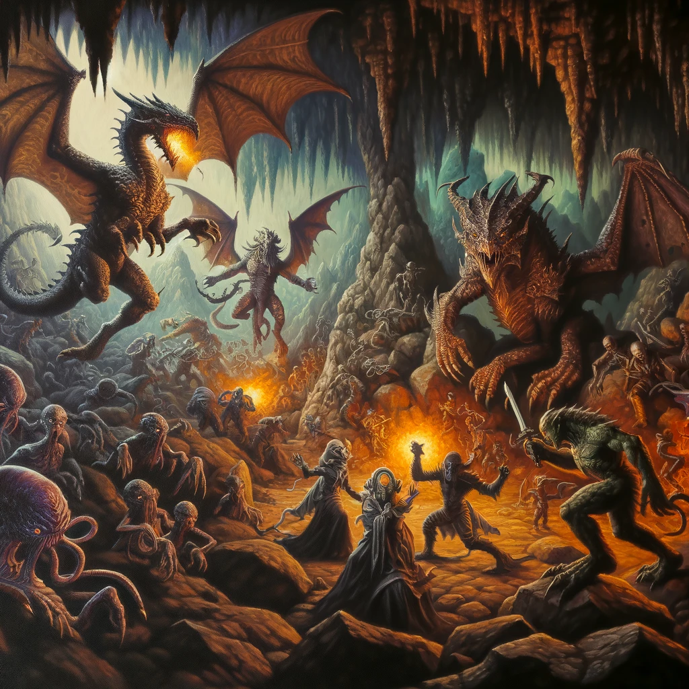
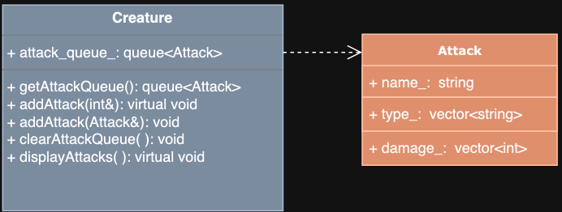
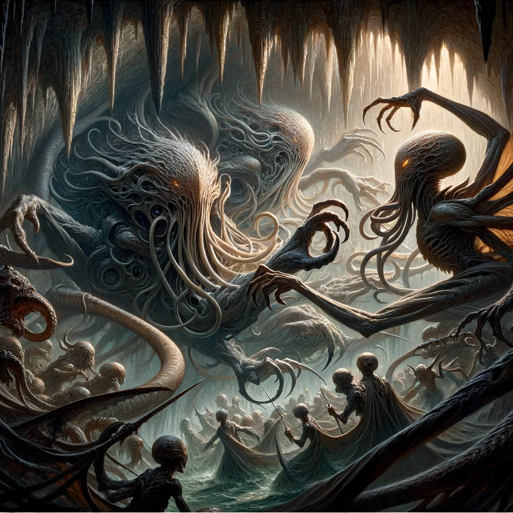
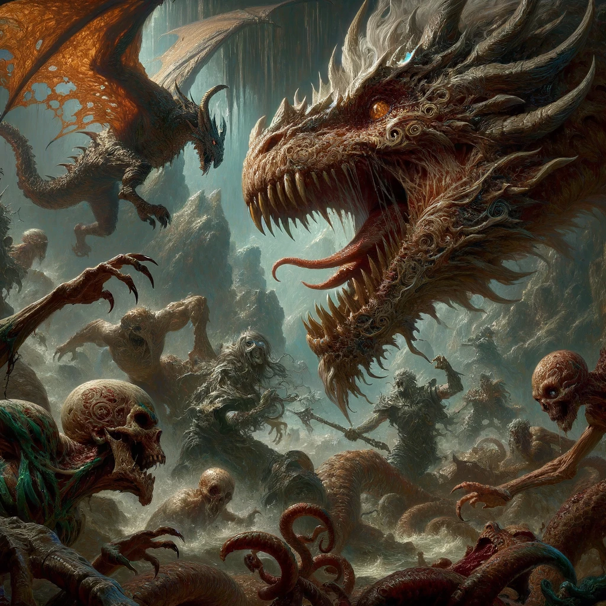
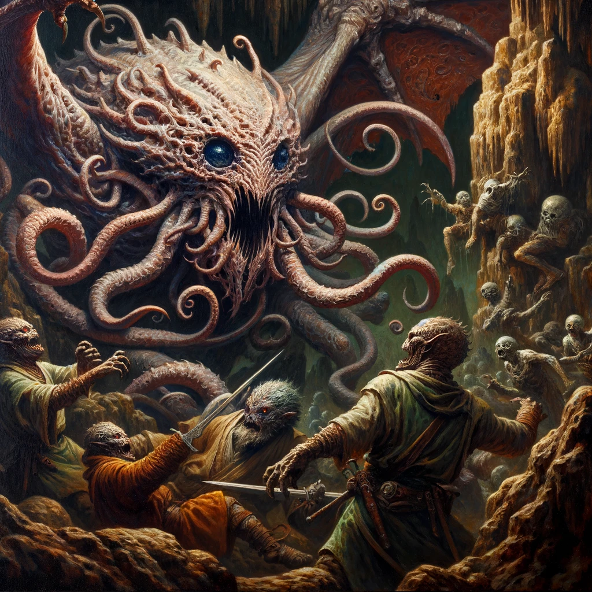
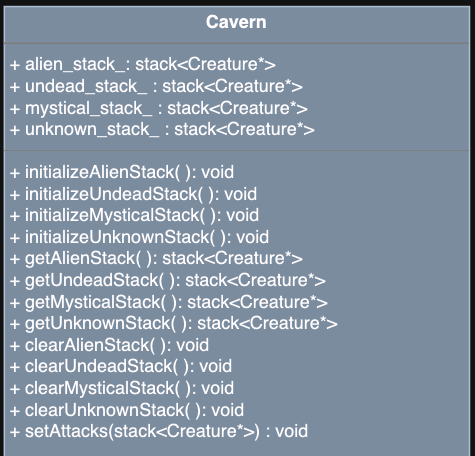

# Algorithmic Adventures II: Exponential Creature Odyssey

## Project 6 - Creature Training!

The mysterious wizard has updated the terms for the job – they would like you to sort out the creatures of the highest level and equip them with a queue of attacks. How this is necessary for a Creature zoo, we're not sure... but it won't be a good adventure without some action! In this project, you will implement the necessary functionality to identify our highest-ranking Creatures in the Cavern and prepare them for battle!



### Getting Started

To accept the GitHub Classroom assignment, please find the link on Blackboard.

### Project Structure

This project consists of three tasks:

1. Modify the `Creature` class so that each character will maintain a queue of `Attacks`. `Attacks` will be defined as a struct within the `Creature` interface (`Creature.hpp`) but outside the `Creature` class definition.
2. Modify the `Creature` subclasses (`Dragon`, `Ghoul`, `Mindflayer`) to manage adding an `Attack` to their queue of attacks and displaying their `Attack` options. Attacks are different for each type of `Creature`.
3. Modify the `Cavern` class to maintain stacks of the highest-level creatures of each category and set `Attacks` for our selected Creatures.

### Additional Resources

- [STL Stack](https://www.cplusplus.com/reference/stack/stack/)
- [STL Queue](https://www.cplusplus.com/reference/queue/queue/)

**Note:** You must include all headers, even if not required by your local environment.

### Implementation

This project may take a while to implement, so start right away! Get Task 1 and 2 out of the way quickly as you may need more testing and debugging time for Task 3. Work through the tasks sequentially (implement and test). Only move on to a task when you are positive that the previous one has been completed correctly. Ensure that the names of classes and methods exactly match those in this specification.

**Important:** You must thoroughly document your code!


### Task 1: Modify the Creature Class

#### Data Types

The following type must be defined in `Creature.hpp` but outside the class definitions:

```cpp
struct Attack {
    std::string name_;
    std::vector<std::string> type_;
    std::vector<int> damage_;
};
```

Each type of creature will have its own attacks. The type and damage of each attack will be based on the Creature's category. Furthermore, each attack may consist of multiple types of attacks with corresponding damage. For example, a MYSTICAL dragon with FIRE element may have a BITE attack that consists of a PHYSICAL attack with damage 4 and a FIRE attack with damage 1.

```cpp
name_ = "BITE"
type_ = ["PHYSICAL", "FIRE"]
damage_ = [4, 1]
```

#### Additional Data Members

- An attack queue to store the creature's attacks



#### Additional Methods

```cpp
/**
  * @return a copy of the attackQueue
*/
getAttackQueue

/**
  * @param: A const reference to int indicating the attack to be added to the queue.
  * Pure virtual function to be implemented by the derived classes
  */
addAttack

/**
  * @param: A const reference to attack to be added to the queue. 
  * @post: The attack is added to the queue
  */
addAttack

/**
  * @post: the attackQueue is emptied
*/
clearAttackQueue

/**
  * @post: Displays the options for the attacks
  * Pure virtual function to be implemented by the derived classes
  */
displayAttacks
```

### Task 2: Modify the Dragon, Ghoul, and Mindflayer Classes

#### Dragon Class


```cpp
/**
  * @param: A const reference to int corresponding to the attack to be added to the attack queue.
  * @post: Adds an attack to the attack queue based on the int parameter.
  * Here are the attacks for the Dragon:
  * 1: Attack name: BITE
  *      if ALIEN: 4 PHYSICAL
  *      if MYSTICAL: 2 PHYSICAL, and additional damage of 1 [FIRE/WATER/EARTH/AIR] if the Dragon has an elemental affinity of FIRE, WATER, EARTH, or AIR)
  *      if UNDEAD: 2 PHYSICAL, 1 POISON
  *      if UNKNOWN: 2 PHYSICAL
  * 2: Attack name: STOMP
  *      if ALIEN: 2 PHYSICAL
  *      if MYSTICAL: 1 PHYSICAL, and additional damage of 1 [FIRE/WATER/EARTH/AIR] if the Dragon has an elemental affinity of FIRE, WATER, EARTH, or AIR)
  *      if UNDEAD: 1 PHYSICAL, 1 POISON
  *      if UNKNOWN: 1 PHYSICAL
  * 3: Attack name: [ELEMENTAL BREATH/BAD BREATH], where the name is ELEMENTAL BREATH if the Dragon has an elemental affinity, otherwise it is BAD BREATH
  *      if ALIEN: 6 [POISON/FIRE/WATER/EARTH/AIR], where the damage type is the Dragon's elemental affinity if it has one, otherwise it is POISON
  *      if MYSTICAL: 3 [POISON/FIRE/WATER/EARTH/AIR], where the damage type is the Dragon's elemental affinity if it has one, otherwise it is POISON
  *      if UNDEAD: 3 [POISON/FIRE/WATER/EARTH/AIR], 1 POISON. The damage types and amount are added to the vector as two separate entries, even if both entries are POISON type.
  *      if UNKNOWN: 3 [POISON/FIRE/WATER/EARTH/AIR] where the damage type is the Dragon's elemental affinity if it has one, otherwise it is POISON  
*/
addAttack

/**
  * @post: displays the attacks of the Dragon in the form:
  * [DRAGON] Choose an attack (1-3):\n1: BITE\t\t2: STOMP\t\t3: ELEMENTAL BREATH\n
  */
displayAttacks
```

#### Ghoul Class


```cpp
/**
  * @param: A const reference to int corresponding to the attack to be added to the attack queue.
  * @post: Adds an attack to the attack queue based on the int parameter.
  * Here are the attacks for the Ghoul:
  * 1: Attack name: BITE
  *   if ALIEN: 4 PHYSICAL
  *   if MYSTICAL: 
  *      if FLESHGORGER: 2 PHYSICAL
  *      if SHADOWSTALKER: 2 PHYSICAL, 1 VOID
  *      if PLAGUEWEAVER: 2 PHYSICAL, 1 POISON
  *      if NONE: 2 PHYSICAL
  *   if UNDEAD: 2 PHYSICAL, 1 POISON
  *   if UNKNOWN: 2 PHYSICAL
  * 2: 
  *   if FLESHGORGER/NONE: 
  *      Attack name: CLAW
  *      2 PHYSICAL
  *   if SHADOWSTALKER:
  *      Attack name: SLASH
  *      2 PHYSICAL, 1 VOID
  *   if PLAGUEWEAVER:
  *      Attack name: INFECT
  *      2 PHYSICAL, 1 POISON
  * 3:
  *   if FLESHGORGER/NONE:
  *      Attack name: FLY SWARM
  *      3 PHYSICAL
  *   if SHADOWSTALKER:
  *      Attack name: SHROUD OF DARKNESS
  *      2 PHYSICAL, 1 VOID
  *   if PLAGUEWEAVER:
  *      Attack name: PLAGUE CLOUD
  *      2 PHYSICAL, 1 POISON
  */
addAttack

/**
  * @post: displays the attacks of the Ghoul in the form:
  * [GHOUL] Choose an attack (1-3):\n1: BITE\t\t2: CLAW\t\t3: CLOUD OF DOOM\n
  */
displayAttacks
```

#### Mindflayer Class



```cpp
/**
  * @param: A const reference to int corresponding to the attack to be added to the attack queue.
  * @post: Adds an attack to the attack queue based on the int parameter.
  * Here are the attacks for the Mindflayer:
  * 1: PSIONIC BOLT/TENTACLE SLAP
  *   If the Mindflayer has a PSIONIC projectile:
  *      Attack name: PSIONIC BOLT
  *      If the Mindflayer has a PSIONIC affinity:
  *          Damage: 3 PSIONIC
  *      Else:
  *          Damage: 2 PSIONIC
  *   If the Mindflayer does not have a PSIONIC projectile:
  *      Attack name: TENTACLE SLAP
  *      Damage: 1 PHYSICAL, 1 EMOTIONAL
  * 2: TELEPATHIC BOLT/TENTACLE SLAP
  *   If the Mindflayer

 has a TELEPATHIC projectile:
  *      Attack name: TELEPATHIC BOLT
  *      If the Mindflayer has a TELEPATHIC affinity:
  *          Damage: 3 TELEPATHIC
  *      Else:
  *          Damage: 2 TELEPATHIC
  *   If the Mindflayer does not have a TELEPATHIC projectile:
  *      Attack name: TENTACLE SLAP
  *      Damage: 1 PHYSICAL, 1 EMOTIONAL
  * 3: ILLUSIONARY BOLT/TENTACLE SLAP
  *   If the Mindflayer has an ILLUSIONARY projectile:
  *      Attack name: ILLUSIONARY BOLT
  *      If the Mindflayer has an ILLUSIONARY affinity:
  *          Damage: 3 ILLUSIONARY
  *      Else:
  *          Damage: 2 ILLUSIONARY
  *   If the Mindflayer does not have an ILLUSIONARY projectile:
  *      Attack name: TENTACLE SLAP
  *      Damage: 1 PHYSICAL, 1 EMOTIONAL
  */
addAttack

/**
  * @post: displays the attacks of the Mindflayer in the form:
  * [MINDFLAYER] Choose an attack (1-3):\n1: PSIONIC BOLT\t\t2: TELEPATHIC BOLT\t\t3: ILLUSIONARY BOLT\n
  */
displayAttacks
```

### Task 3: Modify the Cavern Class




#### Data Types

The `Cavern` class must additionally define the following data members:

- A stack of pointers to the highest level ALIEN Creatures in the Cavern
- A stack of pointers to the highest level UNDEAD Creatures in the Cavern
- A stack of pointers to the highest level MYSTICAL Creatures in the Cavern
- A stack of pointers to the highest level UNKNOWN Creatures in the Cavern



#### Additional Methods

```cpp
/**
  * @post: Stores the ALIEN Creatures of highest level in the cavern's alien stack, in the order in which they appear in the Cavern.
  *      : Empty the stack before beginning.
  */
initializeAlienStack

/**
  * @post: Stores the UNDEAD Creatures of highest level in the cavern's undead stack, in the order in which they appear in the Cavern.
  *      : Empty the stack before beginning.
  */
initializeUndeadStack

/**
  * @post: Stores the MYSTICAL Creatures of highest level in the cavern's mystical stack, in the order in which they appear in the Cavern.
  *      : Empty the stack before beginning.
  */
initializeMysticalStack

/**
  * @post: Stores the UNKNOWN Creatures of highest level in the cavern's unknown stack, in the order in which they appear in the Cavern.
  *      : Empty the stack before beginning.
  */
initializeUnknownStack

/**
  * @return: A copy of the stack of highest level Aliens in the cavern
  */
getAlienStack

/**
  * @return: A copy of the stack of highest level Undeads in the cavern
  */
getUndeadStack

/**
  * @return: A copy of the stack of highest level Mysticals in the cavern
  */
getMysticalStack

/**
  * @return: A copy of the stack of highest level Unknowns in the cavern
  */
getUnknownStack

/**
  * @post: clears the stack of highest level Aliens in the cavern
  */
clearAlienStack

/**
  * @post: clears the stack of highest level Undeads in the cavern
  */
clearUndeadStack

/**
  * @post: clears the stack of highest level Mysticals in the cavern
  */
clearMysticalStack

/**
  * @post: clears the stack of highest level Unknowns in the cavern 
  */
clearUnknownStack

/**
  * @param: A stack of creature pointers 
  * @pre:   All the creatures on the input stack are of the same category and same (highest) level
  * @post:  For each creature in the stack, rebuild the Cavern's appropriate stack.
  *        Clear the Cavern's stack of the given category before adding the creatures to the stack.
  *        Before adding each creature to the Cavern's stack, prompt the user to select 2 attacks for the creature.
  *        Preserve the order of the creatures in the stack given.
  *        If the input is invalid (valid inputs will be 1,2, or 3 only), keep prompting for a non-negative number that is within range, by printing "INVALID INPUT. TRY AGAIN.\n" and prompt for input again.
  *        When a valid action is read, it is passed to the creature's addAttack function to add the corresponding attack to the creature's attack queue.
  *        Prompting for attacks should be done in the following form (hint: use the creature's displayAttacks function):
  *        SELECT 2 ATTACKS FOR [CREATURE NAME] 
  *        [[CREATURE TYPE]] Choose an attack (1-3):
  *        1: [ATTACK 1 NAME]\t\t2: [ATTACK 2 NAME]\t\t3: [ATTACK 3 NAME]
  *        [user input]
  *        [[CREATURE TYPE]] Choose an attack (1-3):
  *        1: [ATTACK 1 NAME]\t\t2: [ATTACK 2 NAME]\t\t3: [ATTACK 3 NAME]
  */
setAttacks
```

### Debugging Help

You have been provided with `creatures.csv` along with your starter code, which you can use with the provided `Cavern` parameterized constructor to test/debug.

An example output of one turn of running `setAttacks()`:

```cpp
SELECT 2 ATTACKS FOR JHARYX
[DRAGON] Choose an attack (1-3):
1: BITE         2: STOMP                3: ELEMENTAL BREATH
1
[DRAGON] Choose an attack (1-3):
1: BITE         2: STOMP                3: ELEMENTAL BREATH
1
SELECT 2 ATTACKS FOR ZYRAJA
[GHOUL] Choose an attack (1-3):
1: BITE         2: CLAW         3: CLOUD OF DOOM
1
[GHOUL] Choose an attack (1-3):
1: BITE         2: CLAW         3: CLOUD OF DOOM
1
```

An example output of one call to `setAttacks()` with invalid input:

```cpp
SELECT 2 ATTACKS FOR VYLTHOR
[DRAGON] Choose an attack (1-3):
1: BITE         2: STOMP                3: ELEMENTAL BREATH
-1
INVALID INPUT. TRY AGAIN.
4
INVALID INPUT. TRY AGAIN.
5
INVALID INPUT. TRY AGAIN.
1
[DRAGON] Choose an attack (1-3):
1: BITE         2: STOMP                3: ELEMENTAL BREATH
2
SELECT 2 ATTACKS FOR LYTHARA
[GHOUL] Choose an attack (1-3):
1: BITE         2: CLAW         3: CLOUD OF DOOM
3
[GHOUL] Choose an attack (1-3):
1: BITE         2: CLAW         3: CLOUD OF DOOM
4
INVALID INPUT. TRY AGAIN.
2
```

### Testing

Although you will no longer submit your test file, you must continue to thoroughly and methodically test your code.

Start by stubbing all expected functions. Have all function declarations in the `.hpp` and stubs for all functions in the `.cpp`. When submitted as such, your program will compile, although you will fail all tests since you have not implemented any functions yet. If your program compiles, you will have at least established that all functions have the correct name, parameters, and return type.

**What is a stub?** A stub is a dummy implementation that always returns a single value for testing (or has an empty body if void). Don’t forget to go back and implement the stub! If you put the word STUB in a comment, some editors will make it more visible.

Now you can start implementing and testing your project, ONE FUNCTION AT A TIME!

Write a `main()` function to test your implementation. Choose the order in which you implement your methods so that you can test incrementally: i.e., implement constructors, then accessor functions, then mutator functions.

For each class, test each function you implement with all edge cases before you move on to implement the next function. This includes all constructors.

Make sure you include all packages and libraries you use.

### Compiling with Makefile

To compile with your Makefile, use the following command in the terminal, in the same directory as your Makefile and your source files:

```bash
make rebuild
```

This assumes you did not rename the Makefile and that it is the only one in the current directory.

### Grading Rubric

- **Correctness:** 80% (distributed across unit testing of your submission)
- **Documentation:** 15%
-

 **Style and Design:** 5% (proper naming, modularity, and organization)

**Important:** Start working on the projects as soon as they are assigned to detect any problems with submitting your code and to address them with us well before the deadline.

### Submission

You will submit the following files:

- `Creature.hpp`
- `Creature.cpp`
- `Cavern.hpp`
- `Cavern.cpp`
- `Dragon.hpp`
- `Dragon.cpp`
- `Ghoul.hpp`
- `Ghoul.cpp`
- `Mindflayer.hpp`
- `Mindflayer.cpp`

Although Gradescope allows multiple submissions, it is not a platform for testing and debugging. You MUST test and debug your program locally. To help you not rely too much on Gradescope for testing, we will only allow 5 submissions per day. Before submitting to Gradescope, ensure that your program compiles using the provided Makefile and runs correctly on the Linux machines in the labs at Hunter. This is your baseline; if it runs correctly there, it will run correctly on Gradescope.

**Due date:** This project is due April 19. No late submissions will be accepted.

### Important Notes

You must start working on the projects as soon as they are assigned to detect any problems and address them with us well before the deadline so that we have time to get back to you before the deadline. There will be no extensions and no negotiation about project grades after the submission deadline.

### Help

Help is available via drop-in tutoring in Lab 1001B (see the website for the schedule). Start early to ensure you get the help you need. The days leading up to the due date will be crowded, and you will not be able to get much help then.

### Authors

- Georgina Woo
- Tiziana Ligorio
