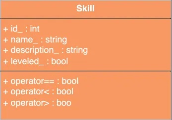
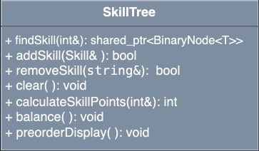

# Algorithmic Adventures II: Exponential Creature Odyssey

## Project 7 - Binary Skill Tree

While our Creatures know how to fight, our wizard boss wants to know how their skills may progress over time. To do this, we will implement a Binary Skill Tree that will allow us to track the skills of our Creatures!


## Getting Started

To accept the GitHub Classroom assignment, follow the link provided on Blackboard.

## Implementation

Work through the tasks sequentially (implement and test). Only move on to a task when you are sure that the previous one has been completed correctly. Remember that the names of classes and methods must exactly match those in this specification (function names, parameter types, returns, preconditions, and postconditions must match exactly).

Remember to thoroughly document your code!

## Task 1: Implement the Skill Struct



### Data Members

- `int id_` - A unique identifier for the Skill
- `std::string name_` - The name of the Skill
- `std::string description_` - The description of the Skill
- `bool leveled_` - Whether or not the Skill is leveled up

### Constructors

```cpp
// Default constructor

// Parameterized constructor
/**
 * @param id: The unique identifier for the Skill
 * @param name: The name of the Skill
 * @param description: The description of the Skill
 * @param leveled: Whether or not the Skill is leveled up
 */
```

### Methods

```cpp
/**
  * @param: A const reference to Skill 
  * @return: True if the id_ of the Skill is equal to that of the argument, false otherwise
  */
operator==

/**
  * @param: A const reference to Skill 
  * @return: True if the id_ of the Skill is less than that of the argument, false otherwise
  */
operator<

/**
  * @param: A const reference to Skill 
  * @return: True if the id_ of the Skill is greater than that of the argument, false otherwise
  */
operator>
```

## Task 2: Implement the SkillTree Class

The `SkillTree` class must be a subclass of `BinarySearchTree` that stores `Skill` objects.


### Constructors

```cpp
// Default Constructor

/**
 * @param: A const reference to string: the name of a CSV file
 * @post: The SkillTree is populated with Skills from the CSV file
 * The file format is as follows:
 * id,name,description,leveled
 * Ignore the first line. Each subsequent line represents a Skill to be added to the SkillTree.
 */
```



### Methods

```cpp
/**
 * @param: A const reference to int representing the id of the Skill to be found
 * @return: A pointer to the node containing the Skill with the given id, or nullptr if the Skill is not found
 */
findSkill

/**
  * @param: A const reference to Skill 
  * @post: The Skill is added to the tree (in BST order as implemented in the base class) only if it was not already in the tree. Note that all comparisons are id-based as implemented by the Skill comparison operators.
  * @return: True if the Skill is successfully added to the SkillTree, false otherwise
  */
addSkill

/**
  * @param: A const reference to string: the name of a Skill
  * @return: True if the Skill is successfully removed from the SkillTree, false otherwise
  */
removeSkill

/**
  * @post: Clears the tree
  */
clear

/**
  * @param: A const reference to int representing the id of a Skill
  * @return: An integer: the number of skill points needed to level up the Skill with the given id, starting from the root (i.e. the number of nodes from root to the given Skill).
  * Note: For a Skill to be leveled up, its parent Skill must also be leveled up, thus the Skill points are the number of Skills that must be leveled up before and including the Skill with the given id.
  * Include the Skill with the given id in the count. For example, if the tree contains the following Skills (represented by their ids):
  *   5
  *  / \
  * 1   8
  * and the function parameter queries for id 8, the function should return 2.
  * Disregard the leveled_ field of the existing Skills in the tree.
  * If the Skill with the given id is not found, return -1.
  */
calculateSkillPoints

/**
  * @post: Balances the tree. Recall the definition of a balanced tree:
  * A tree is balanced if for any node, its left and right subtrees differ in height by no more than 1. 
  * All paths from root of subtrees to leaf differ in length by at most 1
  * Hint: You may sort the elements and build the tree recursively using a divide and conquer approach      
  */
balance();

/**
  * @post: prints the tree in preorder, in the format:
  [id_] [name_]\n
  [description_]\n 
  [leveled_]
  */
preorderDisplay
```


## Testing

### Compiling with Makefile

To compile with your Makefile, use the following command in the terminal, in the same directory as your Makefile and your source files:

```bash
make rebuild
```

This assumes you did not rename the Makefile and that it is the only one in the current directory.

### Incremental Implementation and Testing

Implement and test your programs incrementally! What does this mean? Implement and test one method at a time. For each class:

- Implement one function/method and test it thoroughly (write a main file with multiple test cases + edge cases if applicable).
- Only when you are certain that function works correctly and matches the specification, move on to the next.
- Implement the next function/method and test in the same fashion.

Write your own `main()` function to test your classes. Choose the order in which you implement your methods so that you can test incrementally: i.e., implement constructors, then accessor functions, then mutator functions. Thoroughly test with valid and invalid input to check that your function behaves as expected in each case. Pay special attention to edge cases. Sometimes functions depend on one another. If you need to use a function you have not yet implemented, you can use stubs: a dummy implementation that always returns a single value for testing. Don’t forget to go back and implement the stub! If you put the word STUB in a comment, some editors will make it more visible.

## Grading Rubric

- **Correctness:** 100% (distributed across unit testing of your submission)

No style and documentation points for this last project.

## Submission

We will grade the following files:

- `SkillTree.hpp`
- `SkillTree.cpp`

Although Gradescope allows multiple submissions, it is not a platform for testing and debugging. You MUST test and debug your program locally. To help you not rely too much on Gradescope for testing, we will only allow 5 submissions per day. Before submitting to Gradescope, ensure that your program compiles using the provided Makefile and runs correctly on the Linux machines in the labs at Hunter. This is your baseline; if it runs correctly there, it will run correctly on Gradescope.

**Due date:** This project is due on May 14. No late submissions will be accepted.

## Important Notes

You must start working on the projects as soon as they are assigned to detect any problems and address them with us well before the deadline so that we have time to get back to you before the deadline. There will be no extensions and no negotiation about project grades after the submission deadline.

## Help

Help is available via drop-in tutoring in Lab 1001B (see the website for the schedule). Start early to ensure you get the help you need. The days leading up to the due date will be crowded, and you will not be able to get much help then.

## Authors

- Georgina Woo
- Tiziana Ligorio
